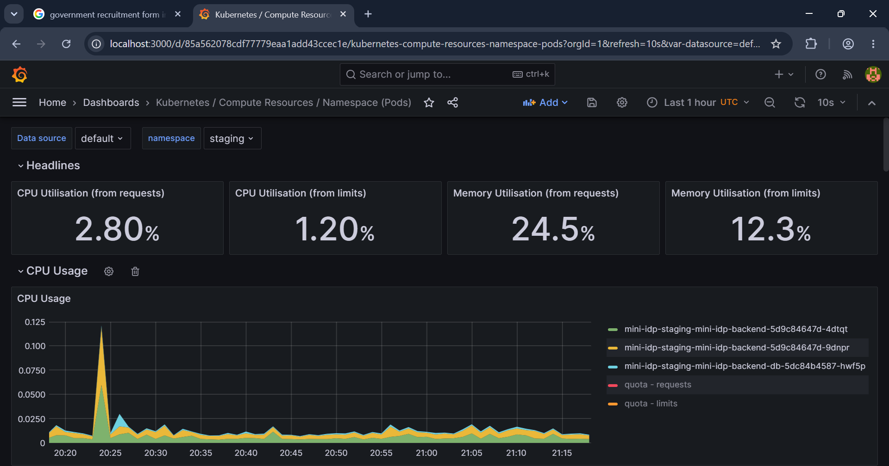

# Mini Internal Developer Platform (IDP) with DevSecOps

A production-style Internal Developer Platform built end-to-end on Kubernetes — GitOps-driven delivery, progressive deployments, embedded security scanning, and chaos-tested resilience, all wired together the way a real platform team would build it.

## What This Solves

Most portfolio projects show a single app deployed to Kubernetes. This project instead demonstrates the **platform layer** around an app: how a team ships code safely, observes it in production, deploys without downtime, and proves their system actually recovers from failure — not just that it runs.

## Architecture

```
Developer pushes code
        │
        ▼
  GitHub Actions CI ──▶ Lint/Test ──▶ Docker Build ──▶ Trivy Scan ──▶ SBOM (Syft) ──▶ Sign (cosign) ──▶ Push to Registry
        │
        ▼
  ArgoCD (GitOps, App-of-Apps) ──▶ Auto-syncs manifests from Git
        │
        ├──▶ Kubernetes (dev)      — plain Deployment
        ├──▶ Kubernetes (staging)  — Argo Rollouts canary deployment
        └──▶ Kubernetes (prod)     — cloud-only, real RDS backend (Terraform)
        │
        ▼
  Observability: Prometheus + Grafana + Tempo
  Security: OPA Gatekeeper, External Secrets + Vault
  Resilience: Chaos Mesh (pod-failure, network-latency experiments)
```

## Tech Stack

| Layer | Tool |
|---|---|
| App | FastAPI (Python), PostgreSQL |
| Containerization | Docker (multi-stage, non-root) |
| Orchestration | Kubernetes (kind, locally) |
| Packaging | Helm |
| IaC | Terraform |
| CI | GitHub Actions |
| GitOps CD | ArgoCD (App-of-Apps pattern) |
| Progressive Delivery | Argo Rollouts (canary) |
| Secrets | External Secrets Operator + Vault |
| Policy Enforcement | OPA Gatekeeper |
| Supply Chain Security | Trivy, Syft (SBOM), cosign (signing) |
| Observability | Prometheus, Grafana, Tempo |
| Chaos Engineering | Chaos Mesh |

## Environments

| Environment | Deployment Type | Database | Status |
|---|---|---|---|
| **dev** | Plain Deployment | In-cluster Postgres | Fully working locally |
| **staging** | Argo Rollouts (canary) | In-cluster Postgres | Fully working locally, used for demos below |
| **prod** | Argo Rollouts (canary) | Managed RDS (cloud) | Requires real cloud infra via Terraform — intentionally not run on local cluster |

## Demo: GitOps + Canary Rollout

A code change was pushed, rebuilt, and deployed to staging entirely through GitOps — no manual `kubectl apply`.

```
Name:            mini-idp-staging-mini-idp-backend
Status:          Healthy
Strategy:        Canary

revision:2 (stable)      — new version fully live, both pods healthy
revision:1 (scaled down) — kept briefly for fast rollback
```

The rollout progressed through defined canary steps (10% → pause → 50% → 100%) automatically once the new image was detected in Git, and the new version was verified serving live traffic:

```json
{"status": "healthy", "database": "connected", "version": "v2"}
```

## Demo: Chaos Engineering


Chaos Mesh experiments were deployed against the staging environment to validate resilience.

**Pod Failure Experiment — Verified Result:**

Experiment: backend-pod-failure
Target: mini-idp-staging-mini-idp-backend-5d9c84647d-9dnpr
Applied: 2026-08-10T21:45:53Z (pod failure injected)
Recovered: 2026-08-10T21:46:23Z (Kubernetes auto-recovered)
Recovery time: 30 seconds
Status: AllRecovered=True, AllInjected=False


Kubernetes successfully detected and recovered from the injected pod failure within 30 seconds, with zero manual intervention — validating the self-healing behavior of the platform.

## Known Issues

- **Loki**: The `loki` ArgoCD Application shows a persistent `Unknown` sync status on this local kind cluster, despite the underlying Helm values being correctly configured for SingleBinary deployment mode. Root cause appears to be a stale comparison in ArgoCD's controller layer that persisted across manifest fixes and repo-server cache clears. Prometheus, Grafana, and Tempo provide full metrics/dashboards/tracing coverage for this demo independent of Loki; log aggregation via Loki is deferred as a follow-up item.
- **Prod environment**: References a managed RDS endpoint as it would in a real cloud deployment via the included Terraform module. This environment is designed to run against actual cloud infrastructure and will not start on a local cluster without that RDS instance provisioned — this is intentional, not a bug.

## Running This Locally

```bash
# 1. Create the cluster
kind create cluster --name mini-idp --config kind-config.yaml

# 2. Install ArgoCD
kubectl create namespace argocd
kubectl apply -n argocd -f https://raw.githubusercontent.com/argoproj/argo-cd/stable/manifests/install.yaml --server-side --force-conflicts

# 3. Apply the root application (bootstraps everything else via GitOps)
kubectl apply -f argocd/root-application.yaml

# 4. Watch it sync
kubectl get applications -n argocd
```

## What This Project Demonstrates

- Designing a GitOps delivery model rather than manual deployments
- Making deliberate infra tradeoffs (e.g., prod requiring real cloud dependencies rather than faking parity locally)
- Debugging real platform issues: ArgoCD sync failures, Helm misconfigurations, resource contention, namespace mismatches
- Validating system resilience with chaos engineering rather than assuming it works
